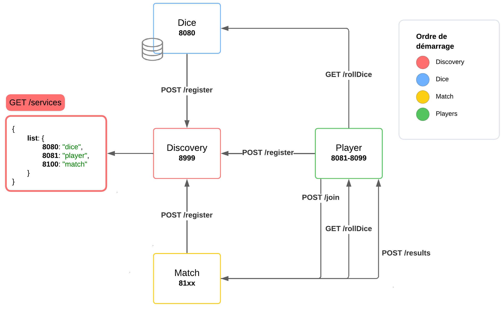

# TD5 - Extension des microservices : Ajout d'un service "Match"

## Objectif

Dans ce TD, vous allez étendre l'architecture microservices existante en ajoutant une nouvelle fonctionnalité : la gestion de parties ("Match"). Vous développerez un nouveau microservice **Match** qui coordonnera les joueurs et orchestrera une partie. Vous devrez également adapter les microservices existants pour prendre en compte ce nouveau service et gérer les échanges nécessaires.

L'objectif est de faire fonctionner l'ensemble de vos services en local comme dans un environnement Dockerisé.

## Fonctionnalités du service **Match**

Le service **Match** :
- Gère une partie entre plusieurs joueurs.
- Stocke les informations suivantes :
    - Liste des joueurs participant à la partie.
    - Nombre maximum de joueurs.
    - Nombre de tours.
    - Score cible pour gagner.
- Coordonne le déroulement de la partie :
    - Les joueurs rejoignent la partie via une requête au service **Match**.
    - Une fois le nombre maximum de joueurs atteint, la partie commence.
    - **Match** demande à chaque joueur de lancer les dés tour à tour via le service **Dice**.
    - La partie se termine si :
        - Un joueur dépasse le score cible.
        - Le nombre maximum de tours est atteint.
    - À la fin de la partie, **Match** notifie tous les joueurs de leurs résultats.

## Flux d'exécution attendu

1. **Initialisation des services** :
    - Le service **Discovery** démarre en premier.
    - Les services **Dice** et **Match** démarrent et s'enregistrent auprès de **Discovery**.
    - Plusieurs instances du service **Player** démarrent (au moins deux pour vos tests), s'enregistrent auprès de **Discovery**, et recherchent une instance disponible de **Match** via **Discovery**.
2. **Participation au Match** :
    - Chaque instance de **Player** demande à rejoindre une partie via le service **Match**.
    - Lorsque le nombre maximum de joueurs est atteint, **Match** commence la partie.
3. **Déroulement du Match** :
    - **Match** demande tour à tour à chaque joueur de lancer les dés via le service **Dice**.
    - **Match** calcule les scores cumulés et vérifie les conditions de victoire (score cible ou nombre maximum de tours).
4. **Fin de la partie** :
    - Le service **Match** déclare le vainqueur et notifie tous les joueurs des résultats.

## Contraintes techniques

### 1. Service **Match**
- **Endpoints à implémenter** :
    - **`POST /join`** : Permet à un joueur de rejoindre une partie.
    - **`GET /status`** : Retourne l’état actuel de la partie (joueurs, scores, etc.).
- **Constantes** :
    - Nombre maximum de joueurs : configurable.
    - Nombre maximum de tours : configurable.
    - Score cible : configurable.

### 2. Services existants
- **Player** :
    - Recherche dynamiquement une instance de **Match** via **Discovery**.
    - Fait une requête pour rejoindre une partie.
    - Attend les instructions de **Match** pour lancer les dés.
- **Discovery** :
    - Continue à jouer son rôle de registre de services.
    - Permet à chaque service de découvrir dynamiquement les autres.
- **Dice** :
    - Fonctionne comme dans les TD précédents pour gérer les lancés de dés.

### 3. Gestion des URL dynamiques (difficulté)
- Configurez vos clients **Feign** pour utiliser des **URIs dynamiques**.
- Fournissez une URL "factice" par défaut dans les clients Feign pour permettre le démarrage. Bonnes explications sur ce post [Stackoverflow](https://stackoverflow.com/a/53504287)
- Adaptez les URLs dynamiques en fonction des informations obtenues via **Discovery**.

## Tests et Déploiement

1. **Tests locaux** :
    - Vérifiez que votre application fonctionne en local, avec plusieurs instances de **Player** interagissant avec **Match** et **Dice**.
2. **Tests Docker** :
    - Assurez-vous que vos services fonctionnent correctement dans un environnement Dockerisé.
    - Faites attention à l'ordre de démarrage des services :
        - **Discovery** en premier.
        - Puis **Dice** et **Match**.
        - Enfin, les instances **Player**.

## Livrables

1. **Code source complet** :
    - Incluez le code du nouveau service **Match**.
    - Adaptez les services existants pour intégrer cette nouvelle fonctionnalité.
2. **Docker** :
    - Mettez à jour vos Dockerfiles et votre fichier `docker-compose.yml` pour inclure le service **Match** et prenez en compte les modifications faites.
    - Assurez-vous que l’ensemble fonctionne avec la commande `docker compose up`.
3. **README** : Ajoutez à votre README les informations pour ce TD :
    - Documentez les étapes nécessaires pour :
        - Démarrer les services en local.
        - Construire et exécuter les conteneurs Docker.
        - Tester le fonctionnement global.
    - Fournissez des commandes claires et directement exécutables.

Bon chance !